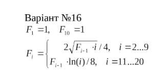
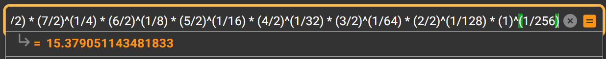

<p align="center"><b>МОНУ НТУУ КПІ ім. Ігоря Сікорського ФПМ СПіСКС</b></p>
<p align="center">
<b>Звіт до Розрахунково-Графічної Роботи</b><br/>
дисципліни "Вступ до функціонального програмування"
</p>

<p align="right"> 
<b>Студент</b>: <em> Саюк Вадим Анатолійович  КВ-21</em>
<p align="right"><b>Варіант</b>: <em>16</em></p>
<p align="right"><b>Рік</b>: <em>2025</em></p>

## Загальне завдання

1. Реалізувати програму для обчислення функції згідно варіанту мовою Common Lisp. Варіант обирається згідно списку варіантів для лабораторних робіт за модулем 16: 1 -> 1, 2 -> 2, ..., 17 -> 1, 18 -> 2 і т.д.
2. Виконати тестування реалізованої програми.
3. Порівняти результати роботи програми мовою Common Lisp с розрахунками
   іншими засобами.

## Постановка задачі конкретного варіанту
      
<p align="center"></p>

## Реалізація програми мовою Common Lisp (текст програми)
   
   ```lisp  
   (defun calculate-F (i)
      "Calculates F(i) for the system of equations:
         1.F(1) and F(10) are equal to 1.
         2.For i=2...9 : F(i) = (2 * SqrtF((i - 1)) * i)/4
         3.For i=11...20 : F(i) = F(i - 1) * Ln(i) / 8
         4.For undefined i returns 0 "
      (cond
         ((= i 1) 1)
         ((and (>= i 2) (<= i 9))
         (/ (* 2.0 (sqrt (calculate-F (- i 1))) (float i)) 4.0))

         ((= i 10) 1)
         ((and (>= i 11) (<= i 20)) 
         (/ (* (calculate-F (- i 1)) (log (float i))) 8.0))

         (t 0)))
   ```
## Реалізація тестових утиліт і тестових наборів (текст програми)
   
   ```lisp
   (defun check-calculate-F (name input expected)
      "Execute `calculate-F' on `input', compare result with `expected' 
       and print comparison status."
      (format t "~:[FAILED~;PASSED~]... ~a: expected = ~a, result = ~a.~%"
               (equal (calculate-F input) expected)
               name
               expected
               (calculate-F input)))

   (defun test-calculate-F ()
      (check-calculate-F "Test1 F(1)" 1 1)
      (check-calculate-F "Test2 F(9)" 9 15.379051) 
      (check-calculate-F "Test3 F(10)" 10 1) 
      (check-calculate-F "Test4 F(20)" 20 2.0372709e-5) 
      (check-calculate-F "Test5 F(21)" 21 0))
   ```
## Результати тестування програми
   
   ```lisp
   CL-USER> (test-calculate-F)
   PASSED... Test1 F(1): expected = 1, result = 1.
   PASSED... Test2 F(9): expected = 15.379051, result = 15.379051.
   PASSED... Test3 F(10): expected = 1, result = 1.
   PASSED... Test4 F(20): expected = 2.0372709e-5, result = 2.0372709e-5.
   PASSED... Test5 F(21): expected = 0, result = 0.
   NIL
   ```
## Порівняння результатів з обчисленням іншими програмними засобами або за допомогою калькулятора
   
   Для перевірки правильності обчислення формули для двох функцій досить перевірити кінцеве значення. Будь-яка некоректна поведінка на проміжних кроках безпосередньо вплине на фінальний результат.  
   ###  Якщо i=9:   
   Розгорнута формула для обрахунку:  
   F(9) = (9/2) * (8/2)^(1/2) * (7/2)^(1/4) * (6/2)^(1/8) * (5/2)^(1/16) * (4/2)^(1/32) * (3/2)^(1/64) * (2/2)^(1/128) * (1)^(1/256)  
   Результат обрахований в WolframAlpha:
  <p align="center"></p>

   ### Якщо i=20:  
   Розгорнута формула для обрахунку:  
   F(20) = (ln(11) * ln(12) * ln(13) * ln(14) * ln(15) * ln(16) * ln(17) * ln(18) * ln(19) * ln(20)) / (8^10)  
   Результат обрахований в WolframAlpha:
   <p align="center"></p>
   
   Порівнявши обрахунки з WolframAlpha та створеній програмі, можна стверджувати, що функція обрахунку реалізована коректно.
   
